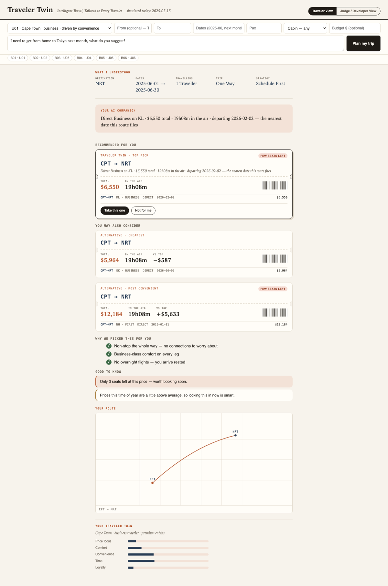
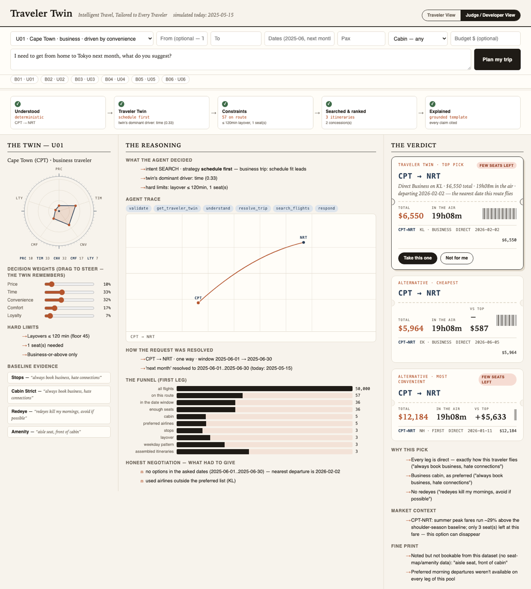

# Traveler Twin — AI Air Travel Companion

[](https://github.com/aswanthiitm/ai-air-travel-companion/actions/workflows/ci.yml)
[](LICENSE)

> **Intelligent Travel, Tailored to Every Traveler**
> A glass-box digital twin of each traveler that negotiates flight trade-offs
> on their behalf — and shows its work.

Built for the **Expedia Group Innovation Hackathon** (Problem Statement 1:
AI Air Travel Companion). See [docs/SOLUTION_SUMMARY.md](docs/SOLUTION_SUMMARY.md)
for the submission-facing problem/solution/impact summary.

**Live demo: [ai-air-travel-companion.vercel.app](https://ai-air-travel-companion.vercel.app)**
(UI on Vercel, API on Render's free tier — the first request after a period
of inactivity can take ~30-50s to wake the API up)

## Screenshots

**Traveler View** — plain-language recommendation, named alternatives, and a route map:



**Judge / Developer View** — the same result through the engine's eyes: Traveler DNA dial, reasoning funnel, agent trace, and the honest concession log:



## The idea

Every flight search engine treats the query as the input. Traveler Twin treats
the **traveler** as the input. It fuses structured profile fields with messy
free-text booking history into an evidence-backed *Traveler Twin*, then uses a
deterministic reasoning engine to filter, score, and negotiate trade-offs —
producing recommendations where **every claim is traceable to a piece of
evidence**.

Signature capabilities (see [docs/ARCHITECTURE.md](docs/ARCHITECTURE.md)):

- **Traveler DNA** — a visual preference signature extracted from structured
  fields *and* raw history, with verbatim evidence behind every trait.
- **Reasoning Funnel** — watch 50,000 flights collapse to a top pick, every
  cut labeled with the trait that caused it.
- **Worth-It Math** — a personal value-of-time extracted from behavior
  ("took a 7hr layover to save $120" → ~$17/hr) used to price every trade-off
  in the traveler's own currency.
- **Honest negotiation** — when constraints are unsatisfiable (they sometimes
  are, by design of the dataset), the system relaxes them step by step and
  reports exactly what each concession cost.
- **Season & scarcity awareness** — real per-route seasonal price uplifts and
  seat-scarcity signals drive "book now vs. wait" advice.

## Project structure

```
data/          Official hackathon datasets (flights, users, benchmark prompts)
src/           Deterministic Python backend
  config.py            Paths + global assumptions (simulated NOW)
  airports.py          Static reference for the 35 airports (tz offsets, coords)
  data_loader.py       Typed CSV/JSON loaders
  preprocessing.py     Enrichment, route indices, seasonal stats, validation
ui/            React flight-deck (Vite): Twin / Reasoning / Verdict panels
docs/          Architecture, deployment, and design documentation
notebooks/     Exploration notebooks
tests/         Pytest suite — dataset invariants + module contracts
Dockerfile              Backend API container
ui/Dockerfile           Frontend container (Vite build + nginx)
docker-compose.yml      Runs both services together
.github/workflows/      CI: pytest + UI build on every push/PR
```

## Quickstart

**Docker (fastest — one command, both services):**

```bash
docker compose up --build
# API   -> http://localhost:8010
# UI    -> http://localhost:8080
```

See [docs/DEPLOYMENT.md](docs/DEPLOYMENT.md) for deploying this to a real
host (Render/Railway/Fly for the API, GitHub Pages/Netlify/Vercel for the UI).

**Manual (two terminals):**

```bash
python3 -m venv .venv && source .venv/bin/activate
pip install -r requirements.txt
pytest                              # dataset invariants + module contracts
python -m src.evaluation            # run all 6 benchmark prompts end-to-end
python -m src.evaluation --report   # + regenerate docs/BENCHMARKS.md

python3 -m uvicorn src.api:app --port 8010     # terminal 1: backend API
cd ui && npm install && npm run dev            # terminal 2: frontend on :5173

# optional agent mode: LLM understanding + composed replies.
# copy .env.example -> .env and set one provider key. Without a key the
# deterministic fallback handles everything (all benchmarks + tests are
# offline).
export GROQ_API_KEY=...          # Groq (llama-3.3-70b-versatile), or
export CEREBRAS_API_KEY=...      # Cerebras (gpt-oss-120b, ~2-6s turns), or
export OPENROUTER_API_KEY=...    # OpenRouter (default: tencent/hy3:free)
export TWIN_LLM_MODEL=...        # optional model override
# live-mode validation: pytest tests/test_llm_live.py (skipped without a key)
```

Requires Python 3.10+. See [docs/BENCHMARKS.md](docs/BENCHMARKS.md) for the
full benchmark output with per-prompt rubric self-checks.

Pick a traveler, fill in as much or as little of the form as you like, and
add a free-text note (or click a benchmark chip). The app opens in
**Traveler View**: what the system understood, a plain-language
recommendation with named alternatives (Worth-It math, scarcity and holiday
badges), a route map, and a readable Traveler Twin summary. Toggle to
**Judge / Developer View** to see the same result through the engine's eyes —
the pipeline strip, the Traveler DNA dial with steerable decision weights,
the agent's reasoning trace, and the honest concession log. Reject a
recommendation with a reason and watch the Twin panel update live.

## Assumptions

Documented as they are made (hackathon FAQ #6):

1. **Simulated "today" = 2025-05-15.** The flight data covers
   2025-01-01 → 2026-07-01. Benchmark prompts use relative dates ("next
   month", "over the summer", "around the holidays") that must resolve inside
   that window. With NOW = 2025-05-15, every forward-looking phrase lands in
   fully covered data. Only relative-date resolution uses this constant
   (`src/config.py`); absolute dates are used as-is.
2. **Local times via fixed UTC offsets.** The dataset stores UTC only, but
   preferences like "morning departures" are local-time concepts. Each
   airport carries its standard-time UTC offset (DST ignored — acceptable
   error for time-of-day *bucketing*).
3. **City → airport mapping is 1:1.** The dataset uses one airport per city
   (e.g. Tokyo = NRT), so city names in requests resolve unambiguously.
4. **`seats_available` is GDS-style capped at 9**; values ≤ 3 are treated as
   a scarcity signal.
5. **`demand_level` and `is_holiday_season` are derived from `season`**
   (verified: perfectly determined by it), so `season` is treated as the
   canonical pricing-context field.
6. **Prices are static per offer** (no fare simulation); "seasonal pricing
   awareness" is computed from real per-route median differences by season.

## Status

| Milestone | Scope | State |
|---|---|---|
| 1 | Scaffold, data loading, preprocessing, validation | ✅ done |
| 2 | Preference extraction → Traveler Profile | ✅ done |
| 3 | Request parsing + inference engine | ✅ done |
| 4 | Recommendation engine (filters, relaxation, scoring, multi-city) | ✅ done |
| 5 | Explanation engine + benchmark runner | ✅ done |
| 6a | FastAPI layer + React flight-deck with working data flow | ✅ done |
| 6b | Visual polish (Traveler DNA dial, route map, funnel animation, boarding passes) | ✅ done |
| 7a | Living Twin store (event-sourced learning, confidence math, profile merge) | ✅ done |
| 7b | Travel Intelligence Agent + Evidence Bundle + AI Companion + /api/plan | ✅ done |
| 7c | Single planning surface UI + live feedback loop | ✅ done |
| 7d | Natural-language input understanding: deterministic normalizer + hybrid LLM gap-fill (LLM only for genuine ambiguity, always validated) | ✅ done |
| 7e | Traveler View / Judge-Developer View UI split; plain-language "why this pick" and "good to know" for travelers, full technical detail preserved for judges | ✅ done |

## Limitations & future work

Tracked in [docs/ARCHITECTURE.md](docs/ARCHITECTURE.md); updated as
milestones land.

## License

MIT — see [LICENSE](LICENSE).
